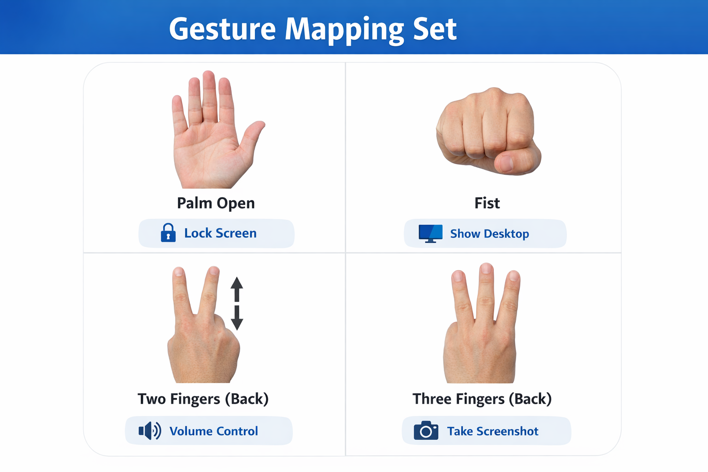

# PalmLock

## Introduction

PalmLock is a Windows-based background utility that enables gesture-controlled system interaction using a webcam. The goal of this project is to eliminate small but repetitive physical interactions with the keyboard and mouse by replacing them with intuitive hand gestures.

By the end of this project, we achieve a real-time computer vision powered system that runs silently in the system tray, detects specific hand gestures using MediaPipe, and performs operating system-level actions such as locking the screen, controlling volume, taking screenshots, and showing the desktop.

PalmLock demonstrates how computer vision, system automation, and modular software architecture can combine to create a practical, real-world desktop utility.

## Objectives

1. Build a real-time hand gesture recognition system using MediaPipe.

2. Map specific gestures to meaningful Windows system-level actions.

3. Design a lightweight system tray-based background utility.

4. Ensure stability, cooldown logic, and controlled gesture execution.

5. Package the application into a distributable Windows executable.

## Workflow / Process (Behind the Scenes)

PalmLock operates in a continuous loop driven by a background engine thread.

Here’s what happens internally:

1. When the user clicks Enable Gesture, the gesture engine starts.

2. The webcam feed is captured using OpenCV.

3. Each frame is processed through MediaPipe’s hand detection model.

4. MediaPipe extracts 21 hand landmarks in real-time.

5. The engine analyzes:

   - Number of fingers raised
   - Palm orientation (front or back)
   - Direction (up/down)

6. If a gesture is detected:

   - The system enters a “HAND” state.

7. If the gesture remains stable for a defined duration:

   - The system enters a “STABLE” state.

8. The corresponding OS-level action is executed.

9. A cooldown timer prevents repeated accidental triggers.

Everything runs in the background while the application lives inside the system tray, making it feel like a native Windows utility.

## Gesture Mapping Set



## Follow These Steps (From Scratch)

If you want to run this project on your system:

1. Clone the Repository

   ```bash
   git clone https://github.com/trushShah/PalmLock.git
   cd PalmLock

2. Create a Virtual Environment

   ```bash
   python -m venv palm_env
   palm_env\Scripts\activate

3. Install Dependancies

   ```bash
   pip install -r requirements.txt

4. Run the Project

   ```bash
   python main.py

You will see a tray icon appear.

Right-click → Enable Gesture → Start using hand gestures.

## File Breakdown

main.py

- Entry point of the application. Starts the tray system.

tray.py

- Manages system tray icon, menu options, and startup registration.

engine.py

- Core gesture detection engine. Handles webcam feed, MediaPipe processing, gesture classification, cooldown logic, and action triggering.

actions.py

- Contains all OS-level automation functions (lock screen, show desktop, volume control, screenshot).

ui.py

- Creates the floating top-left status indicator window (red → yellow → green state).

config.py

- Stores configurable parameters such as cooldown time, detection confidence, and stability duration.

requirements.txt

- Lists all Python dependencies required to run the project.

.gitignore

- Prevents build artifacts, virtual environments, and temporary files from being pushed to GitHub.

## Execution Steps

1. Run from source

   ```bash
   python main.py

2. Build Executable

   ```bash
    pyinstaller --name PalmLock --onedir --noconsole --collect-all mediapipe --hidden-import=pycaw --hidden-import=comtypes main.py

3. Then run

   ```bash
   dist/PalmLock/PalmLock.exe

## Conclusion

PalmLock demonstrates how computer vision can be integrated into practical desktop automation. By combining MediaPipe, OpenCV, PyAutoGUI, and Pycaw within a modular architecture, we created a stable, gesture-controlled Windows utility.

This project reflects a complete development lifecycle — from concept and experimentation to packaging and deployment — resulting in a usable, system-level automation tool.
